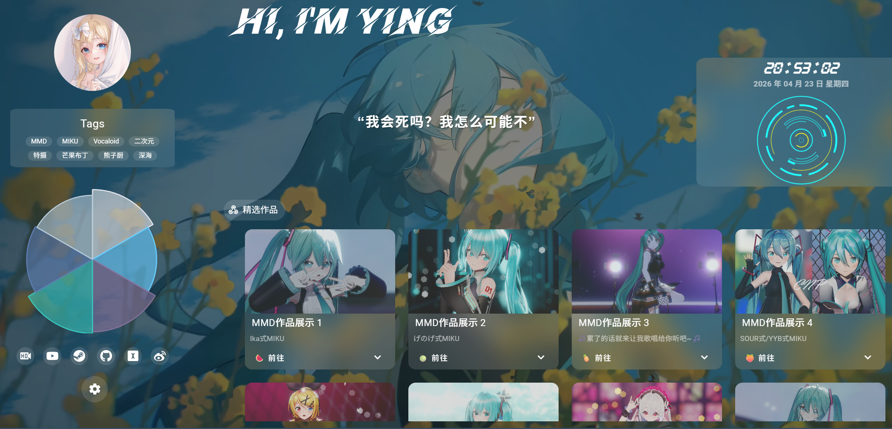

<p align="center">
  
</p>

<h1 align="center">流殇晓萤 ✨</h1>

<p align="center">
  <a href="https://www.namelessying.xin/">🌐 Live Demo</a> •
  <a href="#功能特性">✨ Features</a> •
  <a href="#快速开始">🚀 Quick Start</a> •
  <a href="#配置">⚙️ Configuration</a>
</p>

---

> 简洁优雅的个人主页，展示作品集、博客与社交链接。支持响应式设计与个性化定制。

## 功能特性

- 🎨 **精美设计** — 简洁优雅的视觉风格，支持深色/浅色模式
- 📱 **响应式布局** — 完美适配桌面、平板和手机设备
- 🎬 **精选作品** — MMD作品展示，支持B站视频外链
- 📚 **博客资源** — MMD教程、学习笔记、知识分享等内容入口
- 🔗 **社交链接** — 集成 GitHub、Twitter 等主流社交平台
- 🎵 **音乐播放** — 支持背景音乐自定义播放
- 🌄 **动态背景** — 支持视频背景和静态壁纸
- ☁️ **一键部署** — 支持 Vercel 环境变量在线配置

## 快速开始

### 克隆项目

```bash
git clone https://github.com/your-username/ying_home_page.git
cd ying_home_page
```

### 安装依赖

```bash
npm install
```

### 启动开发服务器

```bash
npm run dev
```

访问 `http://localhost:5173` 查看效果。

## 部署

### Vercel 一键部署

[](https://vercel.com/new/clone?s=https://github.com/your-username/ying_home_page.git)

> 💡 无需服务器，点击链接即可完成部署（需 GitHub 和 Vercel 账号）

### 自定义域名

Vercel 提供的 `.vercel.app` 域名在中国大陆可能无法访问，建议绑定自己的域名。

## 配置

### 方法一：修改配置文件

编辑 `src/config.js` 文件来自定义个人信息、社交链接、背景设置等。

### 方法二：Vercel 环境变量

1. 进入 Vercel 项目面板 → Settings → Environments → Production
2. 添加环境变量：
   - **Key**: `VITE_CONFIG`
   - **Value**: 你的配置内容（JSON 格式）
3. 点击 Redeploy 重新部署

> ⚠️ 环境变量配置的优先级高于本地配置文件

## 技术栈

<p align="left">
  
  
  
  
</p>

## 项目结构

```
ying_home_page/
├── src/
│   ├── components/     # 组件
│   ├── config.js       # 配置文件
│   ├── App.vue         # 主应用
│   └── main.js        # 入口文件
├── public/            # 静态资源
├── img/               # 图片资源
└── package.json
```

## License

MIT © [流殇晓萤](https://www.namelessying.xin/)
